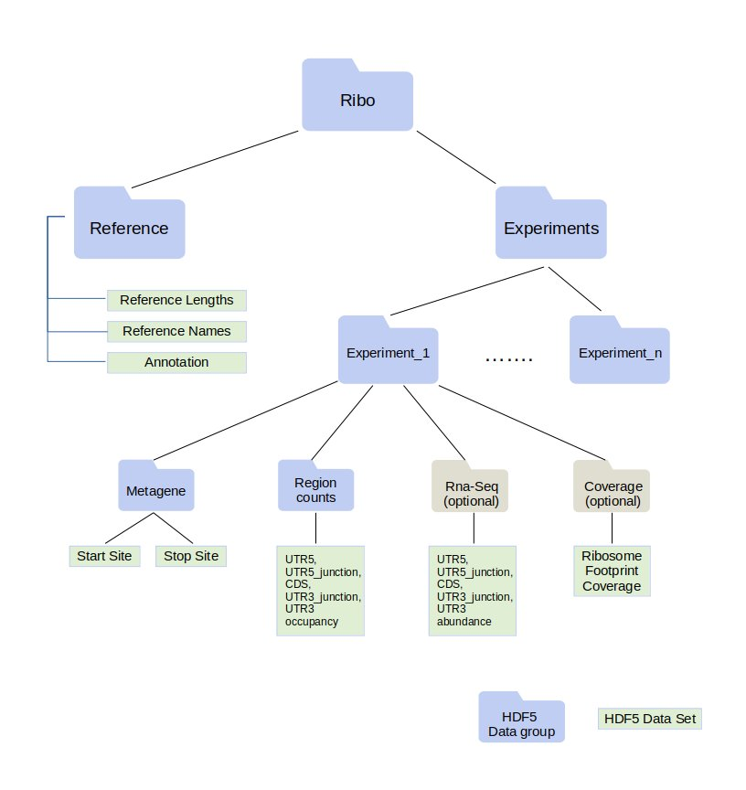
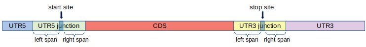

```{r, include = FALSE}
knitr::opts_chunk$set(
  collapse = TRUE,
  comment = "#>"
)
```
## Introduction

[Ribosome profiling](https://www.nature.com/articles/nrg3645) 
is a sequencing based method to study protein synthesis transcriptome-wide.
Actively translating mRNAs are engaged with ribosomes and protein synthesis rates can be approximated by the number of ribosomes that are translating a given mRNA. 
Ribosome profiling employs an RNase digestion step to recover fragments of RNA protected by ribosomes which are called __Ribosome Protected Footprints (RPFs)__.

Ribosome profiling data analyses involve several quantifications for each transcript. Specifically, the lengths of the RPFs provide valuable biological information (see, for example, [Lareau et al.](https://elifesciences.org/articles/01257) and [Wu et al.](https://www.sciencedirect.com/science/article/pii/S1097276518310633?via%3Dihub)). To facilitate ribosome profiling data analyses as a function of RPF length in a highly efficient manner, we implemented a new data format, called [ribo](https://ribopy.readthedocs.io/en/latest/ribo_file_format.html). 
Files in ribo format are called __.ribo__ files.


RiboR package is an R interface for .ribo files. The package offers a suite of reading functions for .ribo files, and provides plotting functions that are most often employed in ribosome profiling analyses. Using RiboR, one can import .ribo files into the R environment, read ribosome profiling data into data frames and generate essential plots in a few lines of R code.

This document is structured into several sections. First, we give an overview of the 
[Ribo File format](#ribofileformat) and define [transcript regions](#transcriptregions).
Second, we provide instructions and requirements for the [installation](installation) of RiboR.
Third, we describe how to import a .ribo file to R environment and demonstrate essential ribosome profiling data analyses in three sections:

   * [Length Distribution](#lengthdistribution)
   * [Metagene Analysis](#metageneanalysis)
   * [Region Counts](#regioncounts)
   
In the following two sections, we describe some [advanced features](#advancedfeatures)
including renaming transcripts using [aliases](#alias), accessing .ribo [file attributes](#fileattributes), and getting [region boundaries](#annotation) that define transcript regions.  
In the [last section](#optionaldata), we explain the three optional types of data, which may exist in a .ribo file.

* [Metadata](#metadata): A .ribo file may contain metadata for each experiment and for the .ribo file itself.
* [Coverage](#coverage): A .ribo file can keep the nucleotide level transcriptome coverage.
* [RNA-Seq](#rnaseq): A ribosome profiling experiment can be paired with an RNA-Seq experiment to study ribosome occupancy together with transcript abundance. 

In the final section, we outline a simple analysis to study translational efficiency.

### .ribo File Format {#ribofileformat}

.ribo files are built on an [HDF5](https://www.hdfgroup.org/solutions/hdf5/) architecture and has a predefined internal structure (Figure 1). For a more detailed explanation of the ribo format, we refer to 
[readthedocs page of ribo](https://ribopy.readthedocs.io/en/latest/ribo_file_format.html).

```{r pressure, echo=FALSE, fig.cap="Figure 1: .ribo File Internal Structure", out.width = '90%', fig.align="center"}

```

While many features are required in .ribo files, quantification from paired RNA-Seq data and nucleotide-level coverage are optional. 

### Transcript Regions {#transcriptregions}

The main protein coding region of a transcript is called the coding sequence (CDS). Its boundaries are called transcription start / stop sites. The region consisting of the nucleotides, between the 5’ end of the transcript and the start site, not translated to protein, is called 5’ untranslated region (5’UTR). Similarly, the region having the nucleotides between the stop site and the 3’ end of the transcript, is called 3’ untranslated region (3’UTR). To avoid strings and variable names starting with a number and containing an apostrophe character, we use the names UTR5 and UTR3 instead of 5’UTR and 3’UTR respectively.

## Installation {#installation}

### Availability
The source code of RiboR package is available in a [public Github repository](https://github.com/ribosomeprofiling/ribor).

### Bioconductor
RiboR is a [Bioconductor](https://www.bioconductor.org) package. 
The following R code installs RiboR via Bioconductor.
```{r install_bioconductor, eval=FALSE}
if (!requireNamespace("BiocManager", quietly = TRUE))
    install.packages("BiocManager")

BiocManager::install("ribor")
```

### Installation From Source Code

RiboR can also be installed directly using the source code.
For this, the following are required.

* **R:** RiboR requires **version 3.6 or later**. Previous R versions are known to cause installation and run time problems.

* **Devtools:** Installing the package requires `devtools`, a CRAN package that provides a wide suite of development tools in the R environment. 

To install the package, run the following lines of code.
```{r install_from_github, eval = FALSE}
install.packages("devtools")
library("devtools")
install_github("ribosomeprofiling/ribor")
```

For Linux distributions, there are some dependencies, required by devtools. 
Installation of these dependencies is necessary to install devtools.
For Ubuntu-based distributions, the following command installs these dependencies.

```{bash install_devtools_dep, eval = FALSE}
sudo apt-get install libxml2-dev libcurl4-openssl-dev libssl-dev -y
```

## Getting Started {#gettingstarted}
We start with loading the RiboR package.
``` {r import_lib, eval = TRUE}
library(ribor)
```
#### Generating a ribo object
To interact with a .ribo file, it is necessary to create a ribo object that provides a direct handle to the file and displays its various attributes. As an example, we processed publicly available ribosome profiling data (GEO accession number [GSE65778](https://www.ncbi.nlm.nih.gov/geo/query/acc.cgi?acc=GSE65778)) from HEK293 cells using [RiboFlow](https://github.com/ribosomeprofiling/riboflow) pipeline to generate the .ribo file in this document. More precisely, we picked two ribosome profiling experiments coming from untreated HEK293 cells (accession numbers: GSM1606107 and GSM1606108) and two RNA-Seq experiments coming from the same line of untreated cells (accession numbers: GSM1606099 and GSM1606100). Each ribo experiment can be paired with a single RNA-Seq experiment. So we arbitrarily paired the ribosome profiling experiment GSM1606107 with RNA-Seq experiment GSM1606099 and GSM1606108 with GSM1606100, when making the example .ribo file in this document. 

```{r createRibo}
#file path to the example ribo file 
file.path <- system.file("extdata", "HEK293_ingolia.ribo", package = "ribor")

#generates the 'ribo' class object 
original.ribo <- create_ribo(file.path, rename = rename_default )
```

**Do not modify the values of the returned ribo object.**
Certain values in the `ribo` object's list are used by later functions, so manually changing these values can alter the correctness of later function calls.

Once the ribo object is created, we can inquire about the contents of the .ribo file.

```{r}
original.ribo
```

The above output provides information about the individual experiments that are contained in the given ribo object. In addition, this output displays some of the parameters, that were used in generating the .ribo file, such as left span, right span and metagene radius.

For a detailed explanation of the contents of this output, we refer to the 
[online documentation of the ribo format](https://ribopy.readthedocs.io/en/latest/ribo_file_format.html). 

In what follows, we demonstrate a typical exploration of ribosome profiling data.
We start with the length distribution of RPFs.

## Length Distribution {#lengthdistribution}
Several experimental decisions including the choice of RNase can have a significant impact on the RPF length distribution. In addition, this information is generally informative about the quality of the ribosome profiling data.  

We use the function `plot_length_distribution` to generate the distribution of the reads mapping to a specific region. This function has also a boolean argument called `fraction`. When fraction is `FALSE`, the y-axis displays the total number of reads mapping to the specified region. When fraction is `TRUE`, the y-axis displays the quotient of the same number as above divided by the total number of reads reported in the experiment.

The following code plots the coding region mapping RPF length distribution in the range of 28 to 32 nucleotides. 

``` {r plot_length_distribution ribo, fig.width = 7}
plot_length_distribution(x           = original.ribo,
                         region      = "CDS",
                         range.lower = 28,
                         range.upper = 32,
                         fraction    = TRUE)
```

We can also plot the absolute number of reads instead of the fraction of total reads by changing the argument `fraction = FALSE`.

``` {r plot_length_distribution_UTR5 ribo, fig.width = 7}
plot_length_distribution(x           = original.ribo,
                         region      = "CDS",
                         range.lower = 28,
                         range.upper = 32,
                         fraction    = FALSE)
```

We can extract the numerical values used to produce the above plot using the function `get_length_distribution` as follows.
The parameters of this function will be explained in more detail later in this document.

``` {r get_length_dist_basic}
rc <- get_length_distribution(ribo.object      = original.ribo,
                                   region      = "CDS",
                                   range.lower = 28,
                                   range.upper = 32)
rc
```

It is also possible to generate the above plot from the DataFrame returned by `get_region_counts`.
This can be useful if the user wants to further process the data prior to plotting.

```{r plot_length_distribution_from_dataframe, eval = FALSE}
# further DataFrame manipulation and filtering can ensue here 
# before calling the plot function

plot_length_distribution(rc, fraction = TRUE)
```


## Metagene Analysis {#metageneanalysis}
A common quality control step in ribosome profiling analyses is the inspection of the pileup of sequencing reads with respect to the start and stop site of annotated coding regions. Given that ribosomes are predominantly translating annotated coding regions, these plots are informative about the enrichment at the boundaries of coding regions and also provide information regarding the periodicity of aligned sequencing reads. This type of plot is called a metagene plot as the reads are aggregated around translation start and stop sites across all transcripts.

The parameter “metagene radius” is the number of nucleotides surrounding the start/stop site and hence defines the region of analysis. For each position, read counts are aggregated across transcripts. This cumulative read coverage (y-axis) is plotted as a function of the position relative to the start/stop site (x-axis).

We can identify the metagene radius of .ribo file using the `get_info` function.
``` {r learn_metagene_radius}
get_info(original.ribo)$attributes$metagene_radius
```

We can plot the ribosome occupancy around the start or stop sites using `plot_metagene`. The following code produces the metagene plot at the start site for the experiment GSM1606107. The values on the y-axis are the raw read counts.

```{r plot_metagene ribo_start, fig.width = 7}
plot_metagene(original.ribo,
              site        = "start",
              experiments = c("GSM1606107"),
              range.lower = 28,
              range.upper = 32)
```

If we don’t provide a specific value for the the experiments parameter, all available experiments will be plotted. 
To better compare these experiments, we can normalize the coverage by setting `normalize = TRUE`. 
In the following example, in addition to these parameters, we set `site = "stop"` to see the stop site coverage. 

```{r plot_metagene ribo, fig.width = 7}
plot_metagene(original.ribo,
              site        = "stop",
              normalize   = TRUE,
              title       = "Stop Site Coverage",
              range.lower = 28,
              range.upper = 32)
```

There are two functions that allow the user to obtain metagene coverage data. 

* `get_metagene`
     * This function returns a DataFrame of metagene coverage.
     
* `get_tidy_metagene`
     * This function returns a tidy DataFrame of metagene coverage. It is a wrapper of the `get_metagene` function, and in order to keep manageable DataFrame dimensions, it will always sum across the transcripts.

When using `length = TRUE` and `transcript = TRUE`, 
the user will obtain the most concise data corresponding to the sum of reads 
surrounding the start / stop site across all read lengths and transcripts. 
As a result, one row of values will be reported for each experiment.

```{r}
#get the start site across read lengths 28 to 32
meta.start <- get_metagene(ribo.object = original.ribo, 
                           site        = "start",
                           range.lower = 28,
                           range.upper = 32,
                           length      = TRUE,
                           transcript  = TRUE)
#only print first ten columns 
print(meta.start[ , 1:10])
```

To obtain the tidy version of the above DataFrame,

```{r}
tidy.meta.start <- get_tidy_metagene(ribo.object = original.ribo,
                                     site        = "start",
                                     range.lower = 28,
                                     range.upper = 32,
                                     length      = TRUE)
head(tidy.meta.start, 2)
```

To maintain the counts at each individual read length summed across transcripts, use `length = FALSE` and 
`transcript = TRUE`. If the metagene data of a single read length, say 30, is needed, set `range.lower` and `range.upper` to 30. By default, data retrieval functions return data from all available experiments. To obtain data from a particular subset of experiments, provide a list of experiment names in the `experiments` parameter.

```{r}
meta.start <- get_metagene(ribo.object = original.ribo, 
                           site        = "start",
                           range.lower = 30,
                           range.upper = 30,
                           experiments = c("GSM1606108"),
                           length      = FALSE,
                           transcript  = TRUE)

print(meta.start[, 1:10])
```

If we wish to preserve the read counts for individual transcript sum across a range of read lengths, we set `transcript = FALSE` and `length = TRUE`. While it is possible to set `transcript = FALSE` and `length = FALSE`,
run times might be slower for this option, 
and running the function with these options requires a substantial amount of memory.

```{r get_metagene_tr_F_len_T}
meta.start <- get_metagene(ribo.object = original.ribo, 
                           site        = "start",
                           range.lower = 28,
                           range.upper = 32,
                           length      = TRUE,
                           transcript  = FALSE,
                           alias       = TRUE)

print(meta.start[1:2, 1:10])
```


As we discussed above for read length analysis, we also provide the option to generate metagene plots using the DataFrames returned by `get_metagene`.
``` {r plot_metagene_from_dt, fig.width = 7}
plot_metagene(tidy.meta.start, normalize = TRUE)
```


### A Note on Aggregating the Output

In the above function calls, we used two parameters `length` and `transcript`, 
which are used, in general, by reading and plotting functions in RiboR. 
These parameters determine how data is aggregated. 

More precisely:

* __length__:
    * If `TRUE`, the counts will be summed up across the given read length interval. Otherwise, if length is `FALSE`, the counts at each individual read length will be included separately in the output.
    
* __transcript__:
    * If `TRUE`, the counts will be summed up across all the transcripts. Otherwise, if transcript is `FALSE`, the counts at each individual transcript will be reported separately.


## Region Counts {#regioncounts}

Another important aspect of ribosome profiling data is the number of reads mapping to the different regions of the transcripts, namely, 5'UTR, CDS and 3'UTR. A large number of reads mapping to UTR5 or UTR3 regions might indicate a poor quality ribosome profiling data since ribosomes occupy CDS. Furthermore, the distribution of reads across these regions can be associated with the RNase choice in the experiment. For example in [Miettinen and Bjorklund](https://academic.oup.com/nar/article/43/2/1019/2414322), it was shown that ribosome profiling experiments are dependent on digestion conditions.

Before going into the R functions, we briefly explain how region counts are computed, introduce our naming convention and define the regions used in ribo format.

For each read mapped to the transcriptome, we take the first nucleotide on the 5' end of the read and determine
the corresponding region. After doing this for all reads, the accumulated values give us the region counts. 

As mentioned earlier, a messenger RNA transcript is partitioned into three regions: 5'UTR, CDS and 3'UTR.
For technical reasons, we rename 5'UTR as UTR5 and 3'UTR as UTR3.

It is well-known that ribosomes pause, or move slower, around start and stop sites. As a result, we observe peaks around start and stop sites in metagene plots. This behavior of ribosome makes it harder to perform certain analyses such as coverage, translation efficiency, periodicity and uniformity analysis with accuracy. 
To tackle this problem, we introduce two additional regions called __UTR5 junction__ and __UTR3 junction__,
and modify the definition of the regions UTR5, CDS and UTR3 as shown in Figure 2. 
This way, we keep regions around start and stop sites separate when doing such analyses.

```{r region_definitions, echo=FALSE, fig.cap="Figure 2: Extended Region Definitions", out.width = '90%', fig.align="center"}

```

More precisely, first, we fix two integers: __left span__ (__l__) and
__right span__ (__r__) and define the __junction__ regions as follows.

* __UTR5 junction:__ This region consists of __l__ nucleotides to the left of the **start** site
   , and __r__ nucleotides to the right of the **start** site.
   
* __UTR3 junction:__ This region consists of __l__ nucleotides to the left of the **stop** site
   , and __r__ nucleotides to the right of the **stop** site.
   
Using these junction regions, we re-define the conventional regions as follows.   
   
* __UTR5__: This region is the set of nucleotides between the 5' end of the transcript and the UTR5 junction.

* __CDS__:  This region is the set of nucleotides between the UTR5 junction and UTR3 junction.

* __UTR3__: This region is the set of nucleotides between the UTR3 junction and the 3' end of the transcript.

Similar to the `get_metagene` function, the `get_region_counts` function has the `transcript` and `length` parameters. As previously mentioned, `transcript` specifies whether or not to sum across the transcripts, and `length` specifies whether or not to sum across the read lengths. 

The following code will plot the number of sequencing reads whose 5’ ends map to the UTR5, CDS, and UTR3 as a stacked bar plot. To facilitate comparison between experiments, the percentage of the regions counts are plotted and the percentage of reads mapping to CDS are printed on the plot.

``` {r plot_region_counts ribo, fig.width = 7}
plot_region_counts(x           = original.ribo,
                   range.lower = 28,
                   range.upper = 32)
```

To get the region counts summed across both lengths and transcripts, set `length = TRUE` and `transcript = TRUE`.

``` {r get_region_counts default}
rc <- get_region_counts(original.ribo,
                        range.lower = 28,
                        range.upper = 32,
                        length      = TRUE,
                        transcript  = TRUE,
                        region      = c("CDS"))
rc
```

When presented with the option of preserving the region counts at each individual read length, it may be preferable to present the transcript names as their shortened aliases.

To get the data only summed across the read lengths, set `length = TRUE` and `transcript = FALSE`. Note that the `alias = TRUE` in this case, and instead of `original.ribo`, we are using `alias.ribo`.

``` {r get_region_counts transcript}
rc <- get_region_counts(original.ribo,
                        range.lower = 28,
                        range.upper = 32,
                        length      = TRUE,
                        transcript  = FALSE,
                        alias       = TRUE,
                        region      = c("CDS"))
rc
```

To get the data in its full form, preserving the information each individual read length and transcript, set `length = FALSE` and `transcript = FALSE`.

``` {r get_region_counts full}
rc <- get_region_counts(original.ribo,
                        range.lower = 28,
                        range.upper = 32,
                        length      = FALSE,
                        transcript  = FALSE,
                        alias       = TRUE,
                        region      = c("CDS"))
rc
```

By default, the DataFrame output is in a tidy form. If non-tidy data set is desired, then set `tidy = FALSE`.

``` {r get_region_counts non-tidy}
rc <- get_region_counts(original.ribo,
                        range.lower = 28,
                        range.upper = 32,
                        tidy        = FALSE)
rc
```

Also, by default, the counts are not normalized, but there is an option to normalize the region counts. Set `normalize = TRUE` to instead obtain the normalized counts per million reads.

``` {r get_region_counts normalize}
rc <- get_region_counts(original.ribo,
                        range.lower = 28,
                        range.upper = 32,
                        normalize   = TRUE,
                        region      = c("CDS"))
rc
```

Similar to the case of metagene and length distribution, the bar plot above can be generated directly from a DataFrame.

``` {r plot_region_counts dt, fig.width = 7}
rc.info <- get_region_counts(ribo.object = original.ribo,
                             region      = c("UTR5", "CDS", "UTR3"),
                             range.lower = 28,
                             range.upper = 32)

# further data frame manipulation and filtering can ensue here 
# before calling the plot function 

plot_region_counts(rc.info)
```


### A Note on the Memory Footprint

In the above function calls, the `compact` parameter is set to TRUE by default, and this parameter is available for all of the offered reading functions. When set to TRUE, it applies Rle (run-length encoding) and factor to several of the columns (notably the columns with repeated values such as experiment, length, and region), and the purpose of this is to reduce the memory footprint of the return values and better accomodate any range of devices using the package.

``` {r memory_footprint_example}
# default return value with compact = TRUE
compact_rc <- get_region_counts(ribo.object = original.ribo, 
                                range.lower = 28,
                                range.upper = 32,
                                length      = TRUE,
                                transcript  = FALSE,
                                compact     = TRUE,
                                alias       = TRUE)
head(compact_rc)
class(compact_rc)
object.size(compact_rc)

# return value with compact = FALSE
# Note that in this example, it takes up twice as much memory
noncompact_rc <- get_region_counts(ribo.object = original.ribo, 
                                   range.lower = 28,
                                   range.upper = 32,
                                   length      = TRUE,
                                   transcript  = FALSE,
                                   compact     = FALSE,
                                   alias       = TRUE)
head(noncompact_rc)
class(noncompact_rc)
object.size(noncompact_rc)
```

If `compact` is FALSE, the called function will return a data.frame instead of a DataFrame, and it will strip the Rle and factor that is applied to several of columns, resulting in a notably larger memory footprint. However, this makes it easier to manipulate and filter the data frame for any downstream analyses, and the data.frame is more readily compatible with other popular packages (i.e. dplyr, tidyr, and ggplot2).


## Advanced Features {#advancedfeatures}

### Alias {#alias}

In the beginning, when we created the ribo object, we used an optional parameter `rename = rename_default`.

```{r createRibo_revisited, eval = TRUE}
original.ribo <- create_ribo(file.path, rename = rename_default )
original.ribo
```

Note that `has.alias` attribute is `TRUE` in the above output. 
When the ribo object is created with the `rename` parameter,
providing alias allows us to rename transcripts, by explicitly setting `alias = TRUE`.

```{r alias_highlight_in_metagene}
meta.start <- get_metagene(ribo.object = original.ribo, 
                           site        = "start",
                           range.lower = 28,
                           range.upper = 32,
                           length      = FALSE,
                           transcript  = FALSE,
                           alias       = TRUE)
meta.start[1:2 , c(1,2,3,38,39,40)]
```

The transcriptome reference, that we used to generate this .ribo file, is from [GENCODE](https://www.gencodegenes.org). In particular, transcript names in this reference are long for the sake of completeness. For example, they include Ensemble transcript and gene ids in addition to standard gene symbols (HGNC).

``` {r cumbersome}
head(get_reference_names(original.ribo), 2)
```

A user might want to work with simplified ids for convenience. To provide this functionality, an optional parameter called `rename` can be provided when initializing a ribo object as shown above.

`rename` parameter can be used in two major ways. The first option is providing a renaming function. This is often a short piece of code that parses the original name and returns a shorter gene, or transcript, name. The RiboR package provides a default renaming function, named `rename_default` for the appris human transcriptome. However, an alternative custom renaming function can also be supplied for example if using a different transcriptome annotation. 

The default renaming function extracts the fifth entry in the transcript name, separated by “|”.


```{r def_rename_default}
rename_default <- function(names){
  return(unlist(strsplit(names, split = "[|]"))[5])
}

rename_default("ENST00000335137.4|ENSG00000186092.6|OTTHUMG00000001094.4|-|OR4F5-201|OR4F5|1054|protein_coding|") 
```

Using the above function, the following code will generate a ribo object and assign an alias to all of the transcripts in a .ribo file.

``` {r alias}
alias.ribo    <- create_ribo(file.path, rename = rename_default)
alias.ribo
```

Notice that when `rename` is not provided, the `alias` attribute will be false.


``` {r noalias}
noalias.ribo    <- create_ribo(file.path)
noalias.ribo
```

We also provide a second option of supplying a string **vector** containing the alias names directly. The string vector should correspond to the order of reference names in the output of get_reference_names. A subsequent call to `set_aliases` can be used to add aliases to an already existing ribo object. Similar to the above use of the rename parameter, `set_aliases` can be invoked with an appropriate renaming function. 

``` {r set_aliases}
#create a ribo file 
alias.ribo    <- create_ribo(file.path)

#generate the vector of aliases
aliases <- rename_transcripts(ribo = alias.ribo, rename = rename_default)

#add aliases
alias.ribo <- set_aliases(alias.ribo, aliases)

head(aliases, 3)

alias.ribo
```


### File Attributes {#fileattributes}
If we want a returned list of previously printed attributes, then the function `get_info` will return all of the attributes found in the root of the .ribo file as well as information on each of the experiments. For a detailed explanation, see [the readthedocs page of RiboPy](https://ribopy.readthedocs.io).

Note that this simply returns a named list of many of the ribo object contents. The returned list organizes the information into three separate values, has.metadata, attributes, and experiment.info. This is a more efficient alternative to simply referencing the values in the ribo object since the method reads directly from the .ribo file handle and not the downstream declared ribo object.

```{r get_info}
#retrieves the experiments
original.info <- get_info(ribo.object = original.ribo)
original.info
```


### Region Boundaries {#annotation}

A .ribo file contains the region boundary information. 
This information can be useful to compare CDS lengths of different transcripts or perform region specific analysis using coverage data.

Some transcripts might have very short regions,
compared to left or right span, in their original annotation.
In this case, when attempting to set the junction boundaries, the UTR5 and/or UTR3 junctions may take the entirety of any combination of the transcript’s original regions (5’ UTR, CDS, and 3’UTR).
Then, UTR5 or UTR3 junctions will take over their nucleotides. 
Thus, in our modified region definitions, 
the coordinates of these regions are marked as `NA` and their lengths will be 0. 

Region coordinates can be obtained using `get_region_coordinates`.
```{r get_region_coordinates}
region_coord <- get_region_coordinates(ribo.object = alias.ribo , alias = TRUE)
head(region_coord, 2)
```

Length of regions can be useful to normalize data, say by CDS length, or to compare different transcripts.
The function `get_region_lengths` gives region lengths for each transcript. 

```{r get_region_lengths}
region_lengths <- get_region_lengths(ribo.object = alias.ribo, alias = TRUE)
head(region_lengths, 2)
```


## Optional Data {#optionaldata}

Length distribution, metagene coverage and region counts are essential to ribosome profiling data analysis and these data exist in every .ribo file. However, for certain types of analysis, additional data might be required.

For example, periodicity and uniformity analyses require the knowledge of number of reads at each nucleotide position, aka coverage data. Another analysis, called translational efficiency, can be done when transcript abundance information is present. An example of this is seen below in the section, `Sample Analysis`. For these types of analyses, .ribo files offer two types of optional data: coverage data and RNA-Seq data.

It might be helpful to have data explaining how ribosome profiling data is collected, prepared and processed. For this, .ribo files has an additional field, called metadata, to store such data for each experiment and for the .ribo file itself.

Optional data don't necessarily exist in every .ribo file. Their existence can be checked as follows.
```{r check_info_for_optional_fields }
original.ribo
```

In the above output, we see that both of the experiments have all optional data as the values in the columns
'coverage', 'rna.seq' and 'metadata' are `TRUE`. Also the .ribo file has metadata as the 'has.metadata' attribute is TRUE. 


### Metadata {#metadata}

A .ribo file can contain metadata for each individual experiment as well as the ribo file itself. If we want to see the metadata of a given experiment, then we can use the `get_metadata` function and specify the experiment of interest. 

To view the metadata of the .ribo file, we use the `get_metadata` function.

```{r get_metadata file, eval = FALSE}
get_metadata(ribo.object = original.ribo, 
             print = TRUE)
#The output is omitted due to its length
```

Metadata can be saved in a variable for later use by setting `print = FALSE`.

```{r get_metadata shortened_meta, eval = FALSE}
info <- capture.output(get_metadata(ribo.object = original.ribo, 
                                    print = FALSE))
info
#The output is omitted due to its length
```

To find the experiments that have metadata and subsequently retrieve it from one of the experiments, consider the following.

```{r get_metadata has.metadata}
#obtain a list of experiments with metadata 
experiment.info <- get_info(ribo.object = original.ribo)[['experiment.info']]
has.metadata <- experiment.info[experiment.info$metadata == TRUE, "experiment"]
has.metadata

#store the name of the first experiment with metadata and gets its metadata
experiment <- has.metadata[1]

get_metadata(ribo.object = original.ribo,
             name        = experiment,
             print       = TRUE)
```
 
### Coverage {#coverage}

For all quantifications, we first map the sequencing reads to the transcriptome and use the  5’ most nucleotide of each mapped read. Coverage data is the total number of reads whose 5’ends map to each nucleotide position in the transcriptome.

Within a .ribo file, the coverage data, if exists, is typically the largest data set in terms of storage, and it accounts for a substantial portion of a .ribo file’s size, when present. The `get_coverage` function returns the coverage information for one specific transcript at a time.

Since coverage data is an optional field of .ribo files, it is helpful to keep track of the experiment names with coverage data. Once the list is obtained, the experiments of interest can easily be chosen and extracted.


``` {r get_list_of_exps_with_coverage}
#get a list of experiments that have coverage data
experiment.info <- get_info(ribo.object = original.ribo)[['experiment.info']]
has.coverage <- experiment.info[experiment.info$coverage == TRUE, "experiment"]
has.coverage
```

Because `get_coverage` takes the transcript name, for annotations with long transcriptome names, it is **recommended** to use aliases and generate a ribo object with a valid `rename` parameter.

The `get_coverage` function retrieves  the coverage across any subset of the experiments. If `length` parameter is `TRUE`, then the coverage counts are summed up across the read lengths.


```{r}
cov <- get_coverage(ribo.object = original.ribo,
                    name        = "MYC-206",
                    range.lower = 28,
                    range.upper = 32,
                    length      = TRUE,
                    alias       = TRUE,
                    tidy        = TRUE,
                    experiments = has.coverage)
cov
```

To preserve the information at ribosome foot print length, set `length = FALSE`.
```{r}
#only using one experiment for this 
exp.names <- has.coverage[1]

#length is FALSE, get coverage information
#at each read length
cov <- get_coverage(ribo.object = original.ribo,
                    name        = "MYC-206",
                    range.lower = 28,
                    range.upper = 32,
                    length      = FALSE,
                    alias       = TRUE,
                    tidy        = TRUE,
                    experiments = exp.names)

cov
```

### RNA-Seq {#rnaseq}

Most ribosome profiling experiments generate matched RNA-Seq data to enable analyses of translation efficiency. We provide the ability to store RNA-Seq quantification in .ribo files to facilitate these analyses. We store RNA-seq quantifications in a manner that parallel the region counts for the ribosome profiling experiment. Specifically, the RNA-Seq data sets contain information on the relative abundance of each transcript at each of the following transcript regions.

* 5' Untranslated Region (UTR5)
* 5' Untranslated Region Junction (UTR5J)
* Coding Sequence (CDS)
* 3' Untranslated Region Junction (UTR3J)
* 3' Untranslated Region (UTR3)

To get started, it might be helpful to store a character vector of the experiment names with RNA-Seq data.

``` {r}
#get a list of experiments that have RNA-Seq data
experiment.info <- get_info(ribo.object = original.ribo)[['experiment.info']]
has.rnaseq <- experiment.info[experiment.info$rna.seq == TRUE, "experiment"]
has.rnaseq
```

To get all of the RNA-Seq data in the sample .ribo file in a non-tidy format, set `tidy = FALSE`.  

``` {r}
#get a list of experiments that have RNA-Seq data
rnaseq <- get_rnaseq(ribo.object = original.ribo,
                     tidy        = FALSE,
                     alias       = TRUE,
                     experiments = has.rnaseq)

#print out the first 2 rows of the DataFrame
head(rnaseq, 2)
```

To get the the RNA-Seq data of the experiment at the `UTR5J`, `CDS`, and `UTR3J` regions only, in a tidy format, set `regions = c("UTR5J", "CDS", "UTR3J")` and `tidy = TRUE`.

```{r}
experiment <- has.rnaseq[1]
rnaseq <- get_rnaseq(ribo.object = original.ribo,
                     tidy        = TRUE,
                     alias       = TRUE,
                     regions     = c("UTR5J", "CDS", "UTR3J"),
                     experiments = experiment)
head(rnaseq, 2)
```

## Sample Analysis  

Here, we outline a  simple analysis highlighting some capabilities of our package.

A common use case for the RNA-Seq data (example seen in the `RNA-Seq`section in `Optional Data`) is to measure translational efficiency. We first filter out poorly expressed transcripts, and visualize the relationship between the RNA-Seq and ribosome profiling region counts.

``` {r rc_rnaseq_sample}
# obtain the rnaseq and ribosomal occupancy of the CDS region
rnaseq_CDS <- get_rnaseq(ribo.object = original.ribo,
                         tidy        = TRUE,
                         alias       = TRUE,
                         region      = "CDS",
                         compact     = FALSE,
                         experiment  = "GSM1606108")


rc_CDS <- get_region_counts(ribo.object    = original.ribo,
                                tidy       = TRUE,
                                alias      = TRUE,
                                transcript = FALSE,
                                region     = "CDS",
                                compact    = FALSE,
                                experiment = "GSM1606108")

# filter out the lowly expressed transcripts  
plot(density(log2(rnaseq_CDS$count)), xlab = "Log 2 of RNA-Seq Count", main = "RNA-Seq Density")
plot(density(log2(rc_CDS$count)), xlab = "Log 2 of CDS Region Count", main = "Region Counts Density")
```

From the above plot, we decided to use a read count threshold of 2 for both the RNA-Seq and ribosome profiling region counts. We then plot the relationship between ribosome profiling and RNA-Seq counts.

``` {r filter_and_plot}
# filter out transcripts with count value less than 2 for either ribosome profiling region counts or rnaseq
filtered_transcripts <- which(rnaseq_CDS$count > 2 & rc_CDS$count > 2)
rnaseq_CDS           <- rnaseq_CDS[filtered_transcripts, ]
rc_CDS               <- rc_CDS[filtered_transcripts, ]
plot(log2(rnaseq_CDS$count), log2(rc_CDS$count), xlab = "RNA-Seq", ylab = "Ribosome Profiling", main = "log2 CDS Read Counts")
```

Next, we caluclate the ratio of ribosome profiling to RNA-Seq counts. This ratio has been used as a rough proxy for translational efficiency in the literature. We then visually inspect the distribution of this ratio.

``` {r translational_efficiency}
# get the translational efficiency of CDS 
te_CDS    <- rc_CDS$count/rnaseq_CDS$count
plot(density(log2(te_CDS)), xlab = "Log 2 of Translation Efficiency", main = "")
```

Using the above density distribution, we next select genes with a log2 ratio of greater than -2. From this threshold value, we identify 229 transcripts that exhibit relatively high translational efficiency.

```{r filter_te}
# filter for translational efficiency of the observed elbow at -2 (on the log2 scale, untransformed value of .25) 
high_te <- rc_CDS$transcript[which(te_CDS > .25)]

# found 229 transcripts, first 20 shown here 
head(high_te, n = 20)
```